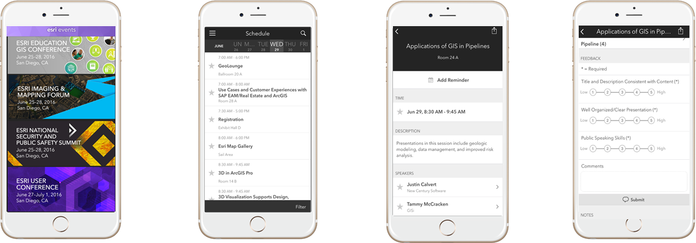

% Harnessing the Power of Python in ArcGIS Using the Conda Distribution
% Shaun Walbridge

<section data-background="images/title.png">
<h2>[https://github.com/scw/conda-uc-2017](https://github.com/scw/conda-uc-2017)</h2>
<h3>[High Quality PDF (2MB)](https://4326.us/esri/conda-uc-2017/uc-2017-conda-arcgis-demo-full.pdf)</h3>
</section>

Python {data-background="images/bg-1.png"}
======

Why Python? {class="tight"} {data-background="images/bg-1.png"}
-----------

 - Accessible for new-comers, and the [most taught first language in US universites](http://cacm.acm.org/blogs/blog-cacm/176450-python-is-now-the-most-popular-introductory-teaching-language-at-top-us-universities/fulltext)
 - Extensive package collection (56 thousand on [PyPI](https://pypi.python.org/pypi)), broad user-base
 - Strong glue language used to bind together many environments, both open source and commercial
 - Open source with liberal license &mdash; do what you want

Why Python? {class="tight"} {data-background="images/bg-1.png"}
-----------

In the box:

 - The SciPy Stack (NumPy, SciPy, Pandas, matplotlib, sympy)

    + [Scientific Programming with the SciPy Stack](https://4326.us/esri/scipy/#/)

 - xlrd, netCDF4, requests, PyPDF, pytz


Getting to Packages {data-background="images/bg-1.png"}
-------------------

{class="tight"}

Why Packages? {data-background="images/bg-1.png"}
-------------

 - Software is composed of many smaller components, often called _packages_ or _libraries_.
 - It's often better to reuse code that solves a problem well rather than recreating it
 - But, sharing code is a **hard problem**. Do you have the same packages of the same versions
   as the developer did?

Package Management for Python {data-background="images/bg-1.png"}
----------------------------

Why not ``pip``, wheels, virtualenvs?

 - Don't handle the harder problem of system dependencies, considered out of scope by Python packagers --- does it end up in ``site-packages``?
 - Package devs: On OSX and Linux, 'easy' to get the deps! Use a system package manager (e.g. ``apt``, ``brew``, ``yum``) and the included compiler (e.g. ``clang``, ``gcc``).
 - It's still not easy to make reproducible builds, and what about Windows?

What about Windows? {data-background="images/bg-1.png"}
-------------------

 * We are particularly stuck on Windows which lacks broadly used package management 
 * Only developers have a C compiler on their machine
 * A hard problem

. . .

 * Enter Conda

Why Conda? {data-background="images/bg-1.png"}
----------

{style="width: 200px; background-color: rgba(255, 255, 255, 1);"}

* Scientific Python community identified that there was a gap not being addressed by the core Python infrastructure, limiting their ability to get packages into the hands of users

* Industry standard built by people who care about this space &mdash; Continuum Analytics

Why Conda? {data-background="images/bg-1.png"}
----------

{style="width: 200px; background-color: rgba(255, 255, 255, 1);"}

* It solves a hard problem:

 - Handles dependencies for many languages (C, C++, R and of course Python)
 - Built for Python first, but it really solves a much broader infrastructural issue.
 - E.g. Use it for isolated R installations, which are usually tricky

Conda {data-background="images/bg-2.png"}
=====

{class="tight"} {data-background="images/bg-2.png"}
-----

 - Cross-platform: simply develop recipes for building and installing software on Linux, OS X and Windows.
 - Open source: Esri is using it, you can use it in your own projects for other contexts

What can it install?  Not just scientific packages. It can help with:

 - GUI toolkits (PyQt, TKinter)
 - C++ Libraries (Boost)
 - IDEs (Spyder, Juptyer)


Conda in Pro {data-background="images/bg-2.png"}
------------

{class="tight"}

{class="tight"} {data-background="images/bg-2.png"}
--------------

 + _Environments_ &mdash;
    - A collection of packages and Python install is called an *environment*, the building block for managing Python with Conda
    - Flexibly make changes without affecting installed software
    - Can create multiple environments and switch seamlessly
 + _Requirements_ &mdash; include explicit state information, not just the package name.

Conda Basics {data-background="images/bg-2.png"}
------------

Activating environments, a couple ways:

 * Use the shortcuts included in Pro
 * Manually activate the environment:

```sh
    cd C:\ArcGIS\bin\Python\Scripts
    activate arcgispro-py3
```

Conda Basics {data-background="images/bg-2.png"}
------------

    conda --help

    conda info

Conda info is the starting point &mdash; it tells you the state of the environment.

Conda Basics Demo {data-background="images/bg-2.png"}
-----------------


Conda Basics {data-background="images/bg-2.png"}
------------

Once you're in an environment get details with ``info``:

    conda info

Conda info is the starting point &mdash; it tells you the state of the environment.

Conda Basics {data-background="images/bg-2.png"}
------------

``conda info``

```
Current conda install:

             platform : win-64
        conda version : 4.0.6
  conda-build version : not installed
       python version : 3.5.1.final.0
     requests version : 2.9.1
     root environment : C:\ArcGIS\bin\Python  (writable)
  default environment : C:\ArcGIS\bin\Python\envs\arcgispro-py3
     envs directories : C:\ArcGIS\bin\Python\envs
        package cache : C:\ArcGIS\bin\Python\pkgs
         channel URLs : https://conda.anaconda.org/esri/win-64/
                        https://conda.anaconda.org/esri/noarch/
                        https://repo.continuum.io/pkgs/free/win-64/
                        https://repo.continuum.io/pkgs/free/noarch/
          config file : C:\ArcGIS\bin\Python\.condarc
``` 

Conda Basics {data-background="images/bg-2.png"}
------------

``conda list``

```
# packages in environment at C:\ArcGIS\bin\Python\envs\arcgispro-py3:
#
#
colorama                  0.3.7                    py35_0    defaults
cycler                    0.10.0                   py35_0    defaults
future                    0.15.2                   py35_0    defaults
matplotlib                1.5.3              np111py35_0e  [arcgispro]  esri
mpmath                    0.19                     py35_1    defaults
netcdf4                   1.2.4                   py35_0e  [arcgispro]  esri
nose                      1.3.7                    py35_1    defaults
numexpr                   2.6.1              np111py35_0e  [arcgispro]  esri
numpy                     1.11.2                  py35_0e  [arcgispro]  esri
pandas                    0.19.0              np111py35_0    defaults
pip                       8.1.2                    py35_0    defaults
py                        1.4.31                   py35_0    defaults
pyparsing                 2.1.4                    py35_0    defaults
pypdf2                    1.26.0                     py_0    esri
pytest                    2.9.2                    py35_0    defaults
python                    3.5.2                         0    defaults
python-dateutil           2.5.3                    py35_0    defaults
pytz                      2016.6.1                 py35_0    defaults
requests                  2.11.1                   py35_0    defaults
scipy                     0.18.1             np111py35_0e  [arcgispro]  esri
setuptools                27.2.0                   py35_1    defaults
sympy                     1.0                      py35_0    defaults
wheel                     0.29.0                   py35_0    defaults
xlrd                      1.0.0                    py35_0    defaults
xlwt                      1.1.2                    py35_0    defaults
```

Conda Basics {data-background="images/bg-2.png"}
------------

Creating new environments:

 - A few different ways. Can manually specify the dependencies:

```
    conda create --name my_env python=3.5 numpy flask dask
```
 - Can also use a file which includes all the dependencies:
```
    conda create --name my_env --file my_sweet_depends.txt
```
These can contain explcit information about channels, to ensure that 
the new environment precisely matches the requirements.

Conda vs... {data-background="images/bg-2.png"}
-----------

Name | Means | Will Ship?
-|-|-
Conda | The command itself | ✓
Miniconda | A minimum set of Python packages to build and run Conda. | ✓
Anaconda | A distribution 200+ packages built with Conda | &nbsp;
Anaconda Server | Host the full infrastructure internally | &nbsp;

Deeper Dive {data-background="images/bg-2.png"}
===========

Demo: Conda Package {data-background="images/bg-1.png"}
-------------------

Multiple Pythons {data-background="images/bg-2.png"}
----------------

Currently:

Platform | Python version
--------|--------
Desktop |  Python 2.7 (2.7.13)
Pro | Python 3.5 (3.5.3)

Multiple Pythons {data-background="images/bg-2.png"}
----------------

Upgrade code?  [Python migration for ArcGIS Pro](http://pro.arcgis.com/en/pro-app/arcpy/get-started/python-migration-for-arcgis-pro.htm)

 - Do it! You can support 2 + 3 without that much work
 - Still need to change ``arcpy.mapping`` to ``arcpy.mp`` when moving from Desktop to Pro, but no Python language level changes needed.
. . .

<br> 
But... this can be costly. For many organizations, a significant burden, even if the
language changes are relatively small. Multiple Pythons is a solution to this.

Challenges {data-background="images/bg-2.png"}
----------

Have to make sure you're running the right Python (_what happens when you type ``python`` at the command line?_)

 - Working to make this easy as possible
 - It'll be easy to tell in app
 - Isolated installation fixes a variety of issues

 - Requires some user education over the "only one Python on the box" model
 - Upgrades, what happens? 
 
What Do I Get Out of the Box? {data-background="images/bg-2.png"}
-----------------------------

* Conda command and a Conda root Python install
* New modules (e.g. ``requests``)
* Conda environment with all of the ArcGIS Pro dependencies as Conda packages

How can I use this? {data-background="images/bg-2.png"}
-------------------

* ArcGIS ships with the SciPy stack &mdash; powerful and out of the box in all products
* Conda command and a Conda root Python install
* New modules (e.g. ``requests``), environment with Pro
* Python Package Manager in Pro
. . .

* Get packages, expand your possibility space
* Package your work: this is an opportunity to distribute it

Where Can I Run This? {data-background="images/bg-2.png"}
---------------------

{class="tight" style="padding: 5px"}

 * ArcGIS Pro 1.3: first with `conda`
 * ArcGIS Pro 2.0:
    - Python Package Manager
    - Python 3.5 with current package set
 * ArcGIS Enterprise 10.5
 * ArcGIS API for Python

`from future import *` {data-background="images/bg-2.png"}
--------------------

 - Effectively manage complex software dependencies with Conda.
 - Thousands of packages exist today, can integrate it into your organization's needs.

Closing {data-background="images/bg-3.png"}
=======

Thanks {data-background="images/bg-3.png"}
------

Esri Conda Team:

{class="tight" style="width:600px"}

Continuum Analytics for creating and open sourcing Conda

Rate This Session {data-background="images/bg-3.png"}
-----------------

Please take our survey, find session in app and provide review

{style="border: none; background: none; box-shadow: none;"}

<span style="display:none">fin</span> {data-background="images/closing.png"}
---

